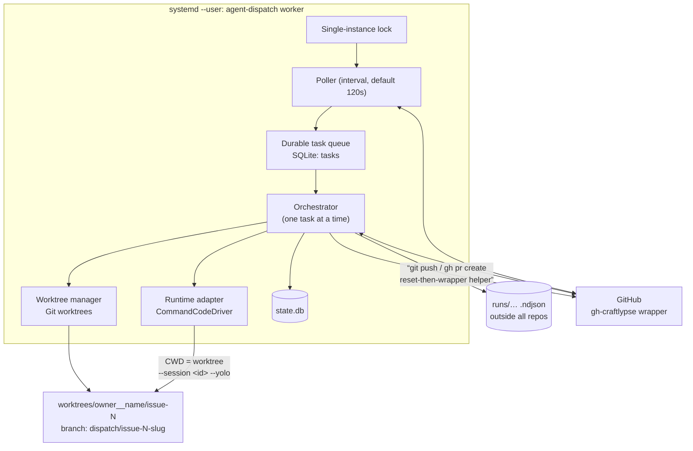

# agent-dispatch — Architecture and Task State Contract

**Issue:** #2 (design-only)
**Status:** Proposed for maintainer review
**Inputs:** [#1 / PR #7](https://github.com/MariuszBielecki288728/agent-dispatch/pull/7) — [`docs/feasibility.md`](./feasibility.md)
**Target environment:** `craftlypse-agent` (Ubuntu 24.04.5, user `craftlypse`, `systemd --user` with `Linger=yes`)
**Implementation plan:** Issues #3 → #6. This document does **not** implement the service.

---

## 1. Goal

A small personal-use tool that:

1. polls an allowlist of configured GitHub repositories for Issues labelled `take-it`,
2. runs a coding agent in a dedicated Git worktree owned by the orchestrator,
3. opens exactly one PR referencing the Issue, then waits,
4. resumes **the same agent session** to address PR feedback, but only after an explicit `agent:fix` handoff.

Explicitly optimised for **simplicity over production-grade multitenancy**. The VM is a trusted single-user development box where the maintainer already runs coding agents with broad permissions. This is not a sandboxing, secrets-broker, policy-engine, or permission-framework project.

---

## 2. Verified ground truth (observed on this VM)

Everything in this section was executed on `craftlypse-agent` on 2026-09-24 against Command Code CLI **v1.64.0**. Items that were *not* verified are marked as unknown rather than assumed.

### 2.1 Permission-mode behaviour (resolves the Issue #2 decision gate)

Issue #1 left an open decision: production unattended file mutation was **not demonstrated** under bounded permissions. The following bounded probes (run in throwaway `/tmp` scratch Git repos) resolve it.

| Probe | Flags used | Result | Mutation |
|---|---|---|---|
| A | `--yolo` | `subtype=success`, exit 0 | **ALLOWED** |
| B | `--permission-mode yolo` | `subtype=success`, exit 0 | **BLOCKED** |
| C | `--tools-all` | `subtype=success`, exit 0 | **BLOCKED** |
| D | `--session <id>` **without** `--yolo` | `subtype=success`, exit 0 | **BLOCKED** |

**Decisions derived from this:**

- **D1 — `--yolo` is the only verified working mutation unlock.** The documented flag name in `--help` (`--permission-mode yolo`) and the closest "enable everything" flag (`--tools-all`) do **not** unlock mutation in print mode. The architecture therefore specifies `--yolo` (alias of `--dangerously-skip-permissions`) as the configured permission mode, and the config records the *literal flag string* so it is auditable rather than implied.
- **D2 — `--yolo` must be re-passed on every invocation, including every resume.** Permission grants do not persist inside a resumed session (probe D). The runtime adapter therefore never treats permission state as sticky session metadata.
- **D3 — Model/effort are likewise re-passed explicitly on every resume.** `--model` persistence across resume was **not** verified. Re-passing the pinned values is a deliberate design choice: it makes "config change silently moves an existing session onto another model" structurally impossible, satisfying the pinning requirement in Issue #2.

### 2.2 Silent false-success hazard (highest-risk finding)

A run whose tool calls were **all blocked** still reported:

```json
{"type":"result","subtype":"success","stopReason":"end_turn","sessionId":"0e751342-…"}
```

with **exit code 0** and **no `isError` field anywhere in the stream**. A naive implementation that trusts `subtype == "success"` will mark a task complete while **nothing was written to disk**.

The only reliable in-band signal is a dedicated NDJSON event:

```json
{"type":"event","event":{"type":"tool_hook_blocked","toolName":"write_file",
 "hookOutput":"Error: Tool \"write_file\" requires permissions. Use --yolo (or --dangerously-skip-permissions) to enable file writes and shell commands in print mode."}}
```

In a successful `--yolo` run this event is **absent** (tool events progress `tool_queued → tool_running → tool_completed`); in each blocked run it was present (1–3 occurrences). This was confirmed by counting occurrences across runs.

> **Requirement:** the orchestrator MUST scan every run's event stream for `tool_hook_blocked` and treat any occurrence as a **hard task failure**, never as success. This is the single most important correctness rule in the design and is called out again in §8 and §9.

### 2.3 Session, stream, and resume facts

- `--output-format json` emits NDJSON: `run_start` carries `sessionId` on the **first line**; the final `result` line carries `subtype`, `sessionId`, `finalText`, `stopReason`, `usage{inputTokens,outputTokens,cacheReadTokens,cacheWriteTokens}`, `durationMs`.
- After a **cleanly completed** run, resume via `--session <id>` keeps the same `sessionId` and retains prior-turn context (verified by asking the agent to recall a filename it created in an earlier turn). Resume also works from a different working directory.
- A turn-cap hit exits with **code 8** (per `--help`), distinct from a normal failure exit 1.
- Confirmed relevant flags: `-p/--print`, `--output-format`, `--session`, `-m/--model`, `--effort`, `--yolo` / `--dangerously-skip-permissions`, `--max-turns`, `-t/--trust`, `--skip-onboarding`, `--no-auto-update`, `--no-skills`, `--list-models`, `-w/--worktree`, `-r/--resume`. 80 models listed; default `deepseek/deepseek-v4-flash`.
- `commandcode status` / `whoami` expose authentication state without printing credentials.

### 2.3.1 An interrupted first run is NOT resumable

The session ID is available early (line 1), so it is worth capturing immediately — but capturing it is **not** sufficient:

- The session transcript (`~/.commandcode/projects/<slugified-cwd>/<session-id>.jsonl`) is written on clean completion. A run killed by timeout/SIGKILL **and even one stopped gracefully with SIGINT** left only `<id>.meta.json` and `<id>.checkpoints.jsonl` — **no transcript**.
- Attempting `--session <id>` against that state fails with: `Error: --session "…" is neither an existing .jsonl transcript nor a known session-id prefix.` (result `subtype: error`, exit 1).

> **Consequence for retries:** an interrupted **first** run cannot be resumed. The bounded retry must start a **fresh** session and re-pin the new ID. Only runs that completed cleanly are resumable for later review rounds. Do not advertise "resume the interrupted run" as a recovery path.

### 2.4 Git credential hazard

`credential.helper` is **multi-valued**, and a bare `-c credential.<url>.helper=!<cmd>` **appends** to the inherited list rather than replacing it. This was verified with instrumented helpers: with a naive single `-c`, the ambient helpers were still invoked **first** and a later helper was only consulted as a fallback. An empty value resets the list ([gitcredentials](https://git-scm.com/docs/gitcredentials#_configuration_options)).

On this VM the effective order for `github.com` is:

1. `/usr/bin/gh auth git-credential` — the **unapproved** raw helper, from `~/.gitconfig`
2. `gh-craftlypse auth git-credential` — the approved wrapper, from `.git/config`

Today the raw helper happens to return **no** credentials, so the chain falls through to the wrapper. That is **incidental, not guaranteed** — it depends on ambient file ordering and on whether a raw `gh` credential ever exists. A single `-c` override alone therefore does **not** ensure the wrapper is used.

> **Requirement:** clear the inherited list, then set the wrapper — in that order:
> ```bash
> git -c credential.https://github.com.helper= \
>     -c credential.https://github.com.helper="!<configured-wrapper> auth git-credential" \
>     <command>
> ```
> Verified: the wrapper answers first and later helpers are never reached.

**Coverage limits — orchestrator commands vs. agent-issued Git.** A per-invocation `-c` applies only to that one process; it is **not** inherited by Git processes the agent spawns itself. Two complementary mechanisms, no auth framework needed:

- **Orchestrator-owned commands** (fetch, worktree add, push, PR): use the reset-then-wrapper `-c` form above.
- **Agent-issued Git inside a worktree:** write the same reset-then-wrapper sequence into the repository's **local** Git config at worktree-provisioning time. A worktree shares `--git-common-dir` with its source clone, so repo-local config is shared and covers child processes automatically. Confirmed on this VM.
- **If a child process must be covered without touching config:** Git's `GIT_CONFIG_COUNT` / `GIT_CONFIG_KEY_n` / `GIT_CONFIG_VALUE_n` environment variables are inherited by children (verified), so they can pin the reset-then-wrapper pair for a process subtree.

This remains an **operational guardrail on a personal VM, not hard isolation**: an unrestricted agent with shell access could reconfigure Git, and nothing here can prevent that. The goal is that the *default* path authenticates with the approved wrapper.

### 2.5 Labels

`take-it` and `agent:fix` **do not exist** in this repository yet (only GitHub's 10 default labels). Issue #3 must create them (or the maintainer must). Until then the trigger protocol is inert by construction — a safe default.

### 2.6 Explicitly unknown / not tested

- Whether `--model` persists across `--session` resume (design avoids depending on it).
- Whether `--tools-enable <names>` can produce a *narrower* working write grant than `--yolo` — **not probed**; assume it cannot.
- Behaviour of concurrent writers against a single session ID; the design prevents it structurally instead.
- Whether resuming a session whose transcript was *partially* written by a crash can ever succeed in a later CLI version. Treat interrupted first runs as non-resumable (§2.3.1).
- Native VS Code Chat UI handoff of CLI sessions remains **unsupported by design** (Issue #1). Operators inspect/resume sessions in the integrated terminal inside the task worktree.
- Behaviour under VM sleep/reboot beyond `systemd --user` restart semantics.

---

## 3. Architecture overview

One Python package, one worker loop, one SQLite database, one `systemd --user` unit. No webhook server, no broker, no distributed leases, no dashboard.



### Component boundaries

| Component | Responsibility | Explicitly **not** responsible for |
|---|---|---|
| **Poller** | Read allowlisted repos for `take-it` Issues and `agent:fix` PRs; enqueue idempotently. | Starting agents; mutating labels it hasn't claimed. |
| **Queue / state store** | Durable task rows, phases, pinned runtime identity, feedback cursors. | Storing Issue/PR bodies (those stay on GitHub). |
| **Orchestrator** | Phase transitions, one-task-at-a-time scheduling, reconciliation, bounded retries. | Being a generic workflow/event-sourcing engine. |
| **Worktree manager** | Create/reuse exactly one branch+worktree per `(repo, issue)`; inject credential helper. | Serving as an OS security boundary. |
| **Runtime adapter** | `start` / `resume` / `status` / `stop` for one runtime; build argv; parse NDJSON; detect `tool_hook_blocked`. | Model selection policy, GitHub access, worktree layout. |
| **GitHub adapter** | Invoke the configured wrapper for issues/PRs/comments/labels and Git HTTPS auth. | Being a transport framework or auth-manager service. |
| **CLI** | `status`, `pause`, `resume`, `retry`, `open`. | Long-running business logic. |

### Runtime adapter contract

The smallest boundary that covers Issues #4–#6:

```python
start(task) -> RunResult      # new session; returns session_id + outcome
resume(task, instruction) -> RunResult
status(task) -> RuntimeStatus
stop(task) -> None

# RunResult: session_id, exit_code, subtype, stop_reason, usage,
#            tool_hook_blocked: bool, final_text, duration_ms
```

`CommandCodeDriver` is the only implementation in the MVP. Adding OpenCode or Codex later means adding one module — **not** rewriting queue, worktree, or review logic. This is deliberately *not* a universal provider-plugin system.

---

## 4. Managed worktree layout

Ownership is recorded, never inferred from directory names.

```
<worktree_root>/<owner>__<name>/issue-<N>/     # e.g. …/MariuszBielecki288728__agent-dispatch/issue-4/
<state_dir>/runs/<repo-slug>/issue-<N>/<run-id>.ndjson   # raw NDJSON logs, OUTSIDE all repos
```

- **Branch:** deterministic, safe slug, e.g. `dispatch/issue-<N>-<kebab-title-truncated>`; collision-suffixed only when the existing branch is provably ours and busy.
- **Base:** configured `base_branch`, fetched fresh before creation.
- The user's normal checkout is **never** modified.
- Worktrees are created with ordinary `git worktree add`; Command Code's own `-w` flag is **not** used, so the orchestrator owns lifecycle, naming, and credentials (per Issue #2 §4).
- Repo-local Git config is written at provisioning time with the reset-then-wrapper credential sequence (§2.4), so agent-issued Git inherits the approved helper.
- Existing PR/branch for the same Issue is adopted rather than duplicated.
- Cleanup happens only via explicit CLI policy, never as a side effect of task completion.

### Ownership evaluation (replaces a naive dirty/clean check)

"Dirty" is **not** a valid proxy for "foreign" or for "failure":

- A **clean** worktree can mean fully successful work — the agent may have committed its changes. Rejecting clean work would discard correct implementations.
- A **dirty** worktree is expected after an interrupted run: the agent's uncommitted edits are legitimate work that must be **preserved**, not stranded.
- A legitimate review round may produce **no** code change at all (the agent correctly decides a comment needs no edit, or explains why). A no-op round is a valid outcome and must be recordable.

Evaluation is therefore by **recorded ownership plus expected diff against the recorded base**, not by dirtiness:

1. **Ownership** — the worktree path and branch must match what the task row records. Ownership is never inferred from directory naming.
2. **Expected change** — for an implementation round, compare `base...HEAD` commits *plus* uncommitted changes. Committed work, uncommitted work, and a combination all count as "produced work".
3. **No-op rounds** — a review round that yields no diff is accepted when the run reported success without `tool_hook_blocked`; the reason is recorded so the maintainer sees *why* nothing changed.
4. **Interrupted runs** — an owned worktree with uncommitted edits is retained and reported. The retry does **not** discard it (see the retry note in §8).

Only a worktree that is **not** recorded against this task (unknown/foreign) is left untouched and escalated to `needs_attention`.

---

## 5. Configuration

Sample: [`config/agent-dispatch.example.toml`](../config/agent-dispatch.example.toml) · Schema: [`config/config.schema.json`](../config/config.schema.json)

Config is **TOML** parsed with stdlib `tomllib` (Python 3.12.3 on this VM — zero third-party dependencies).

Keys that matter for the Issue #2 acceptance list:

| Requirement | Key |
|---|---|
| Configurable GitHub wrapper command | `github.command` |
| Credential helper for Git HTTPS | `github.credential_helper` |
| Repo name + path | `repos."<owner>/<name>".path` |
| Trigger / review labels | `github.labels.trigger`, `github.labels.review_handoff` |
| Command Code runtime / model / effort | `repos.….runtime.{driver,model,effort}` |
| **Explicit** permission mode | `repos.….runtime.permission_mode` (+ `permission_flag`) |
| Timeout | `worker.run_timeout_seconds` |
| Polling interval | `worker.poll_interval_seconds` |

Two rules the config layer enforces at startup (**fail fast, never silently substitute**):

1. **Allowlist.** Any repo not present in `repos` is refused with a clear error, before any API call.
2. **No silent model/provider substitution.** An unsupported `driver`/`model`/`effort` combination is a startup error. The worker never falls back to another paid model.

No tokens, credentials, or provider auth material appear in config or examples — the wrapper owns credentials and exposes them only to its child process.

---

## 6. Task state contract

### Phases

```
queued → running → awaiting_review → feedback_queued → running → …
                 ↘ paused / failed / needs_attention / finished
```

- `queued` — discovered, not yet started.
- `running` — an agent process is live for this task (at most one globally in the MVP). A **review round** uses this phase for the duration of its resumed turn, so the global one-active-task rule covers review work too; the round's own row (`review_rounds.state`) is the authority on *which* work is in flight.
- `awaiting_review` — PR open, no handoff pending.
- `feedback_queued` — reserved: `agent:fix` claimed, one consolidated round pending. The #5 implementation records a claimed round in its own `review_rounds` row and starts it immediately, so the phase is not used as an intermediate; the round row is the durable record, and it distinguishes *claimed but not started* (safe to re-drive) from *turn started* (never auto-repeated).
- `paused` — maintainer-initiated; no new rounds.
- `failed` — bounded retries exhausted, or a blocking error.
- `needs_attention` — ambiguous state requiring a human (e.g. foreign worktree, PR closed externally, an unfinished review round).
- `finished` — PR merged or Issue closed.

### SQLite sketch

```sql
CREATE TABLE tasks (
  id                INTEGER PRIMARY KEY,
  repo              TEXT    NOT NULL,          -- "owner/name"
  issue_number      INTEGER NOT NULL,
  title             TEXT,
  phase             TEXT    NOT NULL DEFAULT 'queued',
  branch            TEXT,
  worktree_path     TEXT,
  base_branch       TEXT,
  pr_number         INTEGER,
  -- pinned runtime identity (never changed after start)
  runtime_driver    TEXT    NOT NULL,
  runtime_model     TEXT    NOT NULL,
  runtime_effort    TEXT,
  permission_mode   TEXT    NOT NULL,
  session_id        TEXT,
  -- review loop
  review_round      INTEGER NOT NULL DEFAULT 0,
  feedback_cursor   TEXT,                       -- last acknowledged event id/ts
  -- bookkeeping
  attempts          INTEGER NOT NULL DEFAULT 0,
  last_error        TEXT,
  last_run_at       TEXT,
  created_at        TEXT    NOT NULL,
  updated_at        TEXT    NOT NULL,
  UNIQUE (repo, issue_number)                   -- one task per Issue, always
);

-- Idempotency for feedback ingestion (Issue #5).
CREATE TABLE feedback_events (
  id            INTEGER PRIMARY KEY,
  task_id       INTEGER NOT NULL REFERENCES tasks(id),
  gh_event_id   TEXT    NOT NULL,               -- stable GitHub id
  kind          TEXT    NOT NULL,               -- comment | review | inline
  consumed_round INTEGER,
  UNIQUE (task_id, gh_event_id)                 -- restarts cannot double-process
);
```

### Implemented review-round state (#5)

The sketch above named `feedback_events` as an event log. The implementation uses a
**round snapshot plus a version cursor** instead, which is simpler and answers the
only two questions that matter: *what did this round carry* and *what has been
acknowledged*.

```sql
CREATE TABLE review_rounds (
  id             INTEGER PRIMARY KEY,
  task_id        INTEGER NOT NULL REFERENCES tasks(id) ON DELETE CASCADE,
  round          INTEGER NOT NULL,          -- also written to tasks.review_round
  state          TEXT    NOT NULL,          -- claimed | running | publish_pending
                                            -- | published | failed | interrupted
  pr_number      INTEGER,                   -- the PR verified as owned at claim
  branch         TEXT,
  worktree_path  TEXT,
  session_id     TEXT,                      -- the session this round resumed
  claimed_at     TEXT NOT NULL,
  started_at     TEXT, finished_at TEXT,
  cursor         TEXT,                      -- JSON: item id -> version claimed
  snapshot       TEXT,                      -- JSON: same, for reporting
  run_id         TEXT,                      -- the round's run row
  head_sha       TEXT,                      -- local tip the round produced
  recovery_stage TEXT,                      -- review-specific publication stage
  attempts       INTEGER NOT NULL DEFAULT 0,
  error          TEXT,
  UNIQUE (task_id, round)
);
```

`tasks.feedback_cursor` holds the acknowledged id -> version map, and
`tasks.handoff_armed` records whether a *present* handoff label is still claimable.
Both are advanced together with the round's completion in one transaction.

The two states a review round must never be left in are prevented structurally:

* **published but unacknowledged** — the round is closed, the cursor advanced, the
  publication marker cleared and the phase set to `awaiting_review` in **one SQLite
  transaction** (`Store.finalise_review_round`). A crash inside it rolls back
  entirely, so the round stays retryable and the feedback stays unacknowledged.
* **acknowledged but not `awaiting_review`** — impossible for the same reason: the
  cursor cannot move without the phase moving with it.

The implementation also reuses the #16 publish-only rule rather than re-deriving it:
the shared push/PR path takes an `on_confirmed` hook, so a review round's
confirmation is its own atomic handover while an implementation run's stays the
single `finalise_publication` write. Letting the round use the implementation
finaliser would set `awaiting_review` while the round stayed open and the cursor
stayed put — exactly the first forbidden state.

`UNIQUE (repo, issue_number)` guarantees a single **task row** per Issue. It does **not** by itself prevent duplicate *external* side effects — a push or PR can succeed just before a crash, and a label can remain set after a round was queued. Those cases are handled by the intent-before-action rules below, not by the constraint.

### Intent-before-action recovery

Persist intent, then act, then confirm:

1. **Record the operation before the call.** Write the expected branch name (and, once known, the PR number) *before* pushing or creating the PR, so a crash leaves a recoverable expectation rather than a guess.
2. **Check GitHub before recreating.** On restart, look for the recorded branch and an open PR whose head is that branch and which references the Issue. Adopt what exists; create only what is missing.
3. **Claim the handoff round once.** When `agent:fix` is claimed, persist the claimed round and the feedback cursor, then clear/re-arm the label exactly once. Repeated polls then see a round already queued and cannot queue a second one.
4. **Capture the session ID as soon as the runtime emits it** (it appears on the stream's first line, §2.3), persisted immediately rather than only after the process exits.

> **Caveat on point 4:** capturing the ID early is necessary but *not* sufficient to resume an interrupted run. A run that did not complete cleanly has no transcript, so its ID is **not** resumable (§2.3.1). The early capture still records which session was attempted, but the retry starts a fresh session. Do not claim "resume the interrupted run" as a recovery path.

State and IDs live in SQLite **outside** target repositories; Issue/PR text stays on GitHub.

### Run logs

Raw NDJSON execution logs are written to `<state_dir>/runs/...` — **outside every target repository and worktree** — with deterministic per-task/per-run filenames. Two reasons this is a requirement, not a preference:

- A log written inside the worktree (e.g. `> run.ndjson` after `cd <worktree>`) can be swept into a commit by `git add -A` and would pollute the PR with raw agent transcripts.
- It would also dirty the worktree, corrupting the ownership/diff evaluation in §4.

Log contents are never printed to CI or pasted into GitHub comments. Retention: bounded by count/size with explicit CLI pruning; `status` may report a log path, not its contents.

---

## 7. Trigger and review-handoff protocol

### `take-it` (dispatch intent)

- An Issue labelled `take-it` expresses *dispatch intent*. It stays on the Issue for the whole active lifetime and is **not** a mirror of local status.
- Already-labelled Issues are found again after a restart (reconciliation, not event replay).
- **Removal** = maintainer intent to stop. The worker stops starting new rounds; an in-flight run is left to finish or is stopped by explicit CLI `pause`.
- **Re-add after removal** starts a fresh scheduling pass but reuses the existing task row, branch, and worktree. It reuses the recorded session ID **only when a run previously completed cleanly**; if the last run was interrupted there is no resumable transcript (§2.3.1), so a fresh session is started. It never creates a duplicate PR.
- **Merged** → task `finished`, PR left untouched.
- **Closed without merge** → task `finished` (no automatic reopen). Surfaced in `status` with the Issue URL.

### `agent:fix` (explicit review handoff)

- **PR review comments alone never start an agent.** Mere feedback arrival only marks the task as having pending review input.
- The label goes on an **open pull request this task owns**. A PR that discovery merely stored in `observed_state.linked_pr_number` is not ours and is never processed.
- A maintainer adds `agent:fix` to the PR. Exactly one **consolidated** follow-up round then runs, resuming the task's **existing** session on the **existing** worktree/branch. The recorded session must come from a run that completed cleanly — an interrupted run has no transcript and cannot be resumed (§2.3.1), in which case the handoff is **refused** with a clear error rather than silently starting a new conversation.
- The label is claimed (and only removed) **after** the round and its feedback snapshot are durably recorded, so a crash cannot lose the handoff.
- Feedback is snapshotted as "everything new since `feedback_cursor`" across top-level comments, inline review comments and submitted reviews. The cursor stores an item's **version** (`updated_at`/`submitted_at`), not only its id, so an edited comment is re-delivered instead of being treated as already handled.
- One round at most is queued. If feedback arrives mid-run, the next round is deferred, never run concurrently in the same worktree.
- Re-arming for a later round = remove `agent:fix`, let the round complete, add it again. A label **left in place is not a standing request for more rounds**: `tasks.handoff_armed` drops to 0 on claim and returns to 1 only after the label has been *observed absent*. Without that, every poll would start another round against feedback that was already applied.
- A handoff that cannot start **yet** (a run in flight, an open round, publication still pending, no new feedback, an unreadable or truncated read) is **deferred with the label left in place** and retried later — nothing is lost and the maintainer does not have to re-add a label they already added.
- A handoff that cannot start **at all** (a merged/closed PR, a foreign PR, no resumable session, a withdrawn `take-it`, an unowned worktree) is **refused**: the reason is recorded, the handoff is consumed so it is not re-reported every poll, and no fresh conversation is started in place of the review round.
- Failure handling is evidence-based, matching the #4 publish-only invariant: once the resumed turn has completed cleanly, a later commit/push/PR failure is finished by a later pass with **zero** further model calls, and the round is only marked published once the remote tip equals the completed local tip. A round interrupted *during* its turn is parked for a human instead, because a turn may already have been paid for and its commits may be half-written.

### Shared-identity safety (critical)

The reviewer and implementer may be **the same GitHub username**. Therefore:

- Role is **never** inferred from login.
- The agent's own PR summary, replies, and progress comments must **never** re-trigger a run. Provenance is tracked by recorded event identity (`feedback_events.gh_event_id`) and round boundaries, not by author name or model.
- An untrusted GitHub comment is *task input*, and a same-account label is **not** an authorization boundary. This is documented plainly rather than dressed up as security; if strong provenance is ever needed, a separate reviewer identity or local maintainer confirmation is the answer.

### What the agent is asked to do with feedback

Not "implement every comment": verify current code, push back on disagreements, and surface requests that exceed Issue scope or need maintainer acceptance. Then push to the same PR branch, report validation truthfully, and return to `awaiting_review`. The agent can never approve or merge its own work.

---

## 8. Worker loop, concurrency, and the runtime command line

### Loop

```
acquire single-instance lock (else exit)      # prevents two workers
reconcile local state with GitHub             # crash recovery, §9
reconcile: check recorded branch/PR before creating either  (§6)
discover: take-it Issues + agent:fix PRs
enqueue / flip phases (idempotent)
while budget and no run in flight:
    pick oldest eligible task (max 1 active total)
    ensure worktree + branch + repo-local credential config
    build instruction (Issue URL, repo AGENTS.md, scope, non-goals)
    run runtime with timeout, streaming NDJSON to <state_dir>/runs/...
    capture session_id on first line; validate stream  ← see below
    evaluate produced work per §4 (committed and/or uncommitted)
    push branch, open/reuse PR, record PR identity
    phase = awaiting_review
sleep(poll_interval_seconds)
```

### Verified Command Code invocation

First turn (note: no redirect inside the worktree — logs live outside, §6):

```bash
cd <worktree>
commandcode -p "<bounded instruction>" \
  --model deepseek/deepseek-v4-flash --effort medium \
  --yolo \
  --output-format json --max-turns 40 \
  --skip-onboarding --no-auto-update \
  > <state_dir>/runs/<repo>/issue-<N>/<run-id>.ndjson
```

Follow-up round (identical except `--session`):

```bash
cd <worktree>
commandcode -p "<consolidated review feedback>" \
  --session <pinned-session-id> \
  --model deepseek/deepseek-v4-flash --effort medium \
  --yolo \
  --output-format json --max-turns 40 \
  --skip-onboarding --no-auto-update \
  > <state_dir>/runs/<repo>/issue-<N>/<run-id>.ndjson
```

`--yolo` and the pinned `--model`/`--effort` appear on **every** invocation (D2/D3). The instruction is passed as a bounded string containing the Issue URL, repository instructions, and explicit scope/non-goals — not the raw Issue body verbatim.

A **review round** (#5) is the same invocation with `--session`, driven by the same
`CommandCodeDriver`, in the same worktree, on the same branch — only the instruction
differs. It carries the new feedback, the earlier already-acknowledged feedback as
context, the observed commit/file state of the branch, and the repository's own
instructions, and it explicitly asks the agent to push back on comments it disagrees
with or that are out of scope rather than implementing them blindly.

### Mandatory post-run validation

A run is accepted **only if all** hold:

1. exit code `0` (a cap hit exits `8`, which is a bounded failure)
2. a `result` line exists with `subtype == "success"`
3. a non-empty `session_id` was captured from `run_start` / `result`
4. on resume, the returned `session_id` **equals** the pinned one
5. **zero `tool_hook_blocked` events** ← the false-success guard (§2.2)
6. **produced work** per §4: the recorded branch shows commits and/or uncommitted changes against the recorded base — **or** the round is explicitly recorded as an intentional no-op

Rules 5 and 6 are the two that a naive implementation gets wrong. Rule 5 exists because the CLI would otherwise report success for a run that wrote nothing. Rule 6 is deliberately *not* "the worktree must be dirty": a clean tree may mean the agent committed correctly, and an uncommitted diff is still legitimate work. Only rule 5 is a hard failure signal on its own; rule 6 records the produced-work outcome for human review.

Rule 6 differs for a **review round**: an implementation run that produces nothing
must not open an empty PR, whereas a review round that correctly concludes that a
comment needs no code change is a *valid* outcome and is accepted and recorded as a
no-op. What is never allowed is claiming changes were made — the round's committed
diff is what the PR branch actually carries.

### Retry semantics after an interrupted run

An interrupted run left no transcript, so it cannot be resumed (§2.3.1). The bounded retry therefore:

- starts a **fresh** session and re-pins the new session ID,
- **preserves** any uncommitted edits the interrupted agent left in the owned worktree, and
- reports clearly that this was a fresh attempt, not a continuation.

The same limitation decides the review loop's refusal rule: a handoff with no cleanly
completed session is **refused** with an actionable message, because starting a fresh
conversation and calling it a review round would be a different, unverifiable thing.

### Review-round retry semantics (#5)

A round is *claimed* from its durable snapshot before anything else happens, and the
claimed/
started boundary is what decides whether a failure may be retried automatically:

| Round state at crash | Repair |
|---|---|
| `claimed` (no turn started) | Re-drive the **same** round — same snapshot, same session. No model turn was paid for, so this costs nothing but a repeated read. |
| `running` (a turn was in flight) | Park as `interrupted`. A turn may already have been paid for and its commits may be half-written, so **nothing** is auto-repeated; the reason is recorded and the feedback stays unacknowledged. |
| `publish_pending` (the turn completed cleanly) | Finish the publication on a later pass with **zero** model calls, after verifying the remote tip equals the completed local tip. The round is marked published only once that matches. |
| `failed` (the turn itself failed) | Parked for a human. The snapshot stays unacknowledged, so fixing the cause and re-adding the label retries the *same* feedback rather than losing it. |

A publication failure never overwrites a more specific reason: the recorded stage is
the evidence that finished work exists, and downgrading it would make the round
permanently unpublishable after one transient outage (§9's rule, applied to review).

### Concurrency and limits

- **One active task total** for the MVP (`worker.max_concurrent_tasks = 1`).
- At most **one writer per worktree**, guaranteed by the single-task rule.
- `run_timeout_seconds` (default 3600) kills a hung run.
- `max_attempts` (default 3) with backoff bounds retries; exhaustion → `failed` with a human recovery path.
- A single-process lock file prevents accidentally running two workers.

---

## 9. Failure handling and reconciliation

Bounded, boring recovery — no self-healing machinery.

| Crash point | Reconciliation on startup / next poll |
|---|---|
| Agent process dies mid-run | `running` with a dead PID → `failed`; bounded retry starts a **fresh** session (interrupted run is not resumable, §2.3.1) and **preserves** uncommitted edits |
| Branch pushed, PR creation failed | Detect the recorded branch on the remote; retry PR creation only, never re-run the agent |
| PR created but DB write failed | Discover PR by head branch **and** verify it references the Issue; adopt its real PR identity |
| Duplicate poll / label event | Single task row per Issue (§6); already-terminal phase → no-op |
| Handoff queued but crash before ack | Round re-derived from the claimed round + `feedback_cursor`; re-arm `agent:fix` once; never double-applied |
| Crash after the round's claim but before the label is removed | The label is still visible but no longer *armed*, so it cannot start a second round; the claimed round is re-driven because no turn was paid for yet |
| Dispatcher dies during a review round's turn | Round parked as `interrupted`; **no** automatic re-run (a turn may have been paid for); feedback stays unacknowledged |
| Round's turn completed, then commit/push/PR failed | Finished publish-only with **zero** model calls, after the remote tip is verified against the completed local tip; the round is marked published and the cursor advanced only then |
| Crash between publishing a round and acknowledging its feedback | Both are one SQLite transaction, so neither can happen without the other |
| Issue relabelled `take-it` removed | Stop new rounds; keep existing work |
| Owned worktree with uncommitted edits | **Preserve**; report in `status` as interrupted work |
| Worktree unknown / not recorded for this task | `needs_attention` — **never** auto-delete |
| Review round produces no diff | Accepted when success without `tool_hook_blocked`; reason recorded |
| Model/provider unavailable, auth denied | `failed` with the real error. **No** silent model substitution |
| Repo not in credential allowlist | Fail fast at startup / before the first API call with an explicit message |
| GitHub rate limit | Backoff; task stays queued |
| VM asleep or off | Nothing runs; on boot `systemd --user` restarts and reconciles |

Ambiguous cases prefer an explicit **`needs_attention`** state over clever automation. `status` always shows the Issue/PR URLs, branch, worktree, session ID, last observed validation outcome, and any outstanding maintainer decision.

---

## 10. Security posture and tradeoffs

### Stated plainly

- **`--yolo` grants the agent unrestricted shell and file access as `craftlypse`.** The maintainer has explicitly accepted this on this trusted personal VM. Documented as a *trust choice*, not isolation.
- **A Git worktree is Git isolation only.** It is **not** a filesystem, process, network, or credential boundary. In allow-all mode the agent can read and write outside its worktree and can reach the same user's credentials. These are consciously accepted risks, not guarantees the orchestrator can enforce. This document does **not** claim `--yolo + worktree` forms a sandbox.
- **GitHub access is wrapper-scoped, not agent-scoped.** The `gh-craftlypse` credential is limited to selected repositories; the wrapper validates ownership/mode (`0600`) and injects `GH_TOKEN` only into its child. The agent, having unrestricted shell access, could in principle attempt to bypass it — so this is described as a *checkable operational guardrail*, not a hard boundary.
- The wrapper name is **configurable**, not hardcoded into the reusable package; this VM binds it to `gh-craftlypse`. Tokens are never inspected, printed, copied, or committed. `gh auth login` is never run and raw `gh` is never substituted on this VM.
- The double credential-helper hazard (§2.4) is **reduced, not eliminated**, by clearing the inherited helper list and then setting the wrapper — per invocation for orchestrator commands, and in repo-local config so agent-issued Git inherits it. Because `credential.helper` is multi-valued and appends by default, a single `-c ...helper=!<cmd>` would **not** have been sufficient; the reset entry is what makes it work. This is a guardrail, not isolation: an unrestricted agent could reconfigure Git.

### Operational guardrails

Repository allowlist · no automatic merge · no Issue closure · no reviewer approval · no touching unrelated repositories · one task at a time · run timeout and bounded retries · no token or raw-log dumping · explicit `pause`/`stop`.

### Consciously accepted tradeoffs

| Tradeoff | Rationale |
|---|---|
| Broad `--yolo` permissions | Simplicity on a single-user trusted VM; the alternative was a policy engine this project deliberately avoids. |
| Polling (~120 s) instead of webhooks | No inbound endpoint on a personal VM, no broker, no public exposure. |
| Single active task | Prevents two writers in one worktree and keeps model cost predictable. |
| Shared GitHub identity for review handoff | Simple; provenance tracked by event identity, with the limitation documented rather than hidden. |
| Worktree ≠ sandbox | Honest limitation instead of security theatre. |
| Interrupted runs cannot resume, so retries start a fresh session | A CLI transcript limitation (§2.3.1); the alternative would be claiming a recovery path that does not exist. |
| SQLite + one process | Sufficient durability and auditability for one VM. |

---

## 11. MVP / later / out of scope

### MVP (Issues #3–#6)

- One package, one worker loop, one SQLite DB, one `systemd --user` unit.
- GitHub adapter over the **configurable** wrapper, with credential-helper injection.
- `CommandCodeDriver` only, with the verified argv and the `tool_hook_blocked` guard.
- Orchestrator-owned worktrees, one per `(repo, issue)`, deterministic branch naming, repo-local credential config, and logs kept outside every repository.
- `take-it` dispatch + explicit `agent:fix` single-round review loop with same-session resume (completed runs only).
- CLI: `status`, `pause`, `resume`, `retry`, `open`, `doctor`, `dry-run`.
- Bounded retries, restarts, and startup reconciliation.
- Startup capability validation and repo allowlist enforcement.

### Later (explicitly not MVP)

- Additional runtime drivers (OpenCode, Codex) as small adapters.
- Multi-repo concurrency above one.
- Optional OS/container isolation as a deployment choice.
- An orchestrator-owned reviewer job emitting a *trusted* completed-review event instead of a manual PR label.

### Out of scope

- Webhook server, message broker, distributed leases, cloud service, dashboard, GUI.
- Auto-merge, automatic reviewer fleets, Issue closure, forced pushes to unrelated branches.
- Sandbox tiers, permission policy languages, secret-vault integration, multi-tenant auth.
- Universal model-provider plugin framework.
- GitHub Actions execution of unattended paid agents.
- Docker/container requirement as an MVP acceptance gate.

### Portability statement

**Command Code is the initial implementation, not a permanent provider lock-in.** Switching runtime later is *configuration plus one small adapter*; selecting a different supported model *within* Command Code is usually just a config change. Existing tasks remain pinned to their recorded `runtime_driver`, `runtime_model`, and `session_id`, and config changes never mutate an in-flight or resumable session.

---

## 12. Verification outline for Issues #3–#6

Routine CI must not spend model credits; real runs are opt-in and low-cost.

**#3 — foundation (no agent)**
- Mock GitHub adapter: idempotent discovery of `take-it`; enqueue twice yields one task.
- Denied/absent repo → explicit early failure; mock coverage for allowlist denial.
- Restart mid-queue → no duplicate task rows.
- Real `systemd --user` run against the actual wrapper (opt-in).
- Single-instance lock proven to reject a second worker.

**#4 — execution and PR**
- Disposable-repo E2E: labelled Issue → exactly one branch/worktree → one persisted session → bounded run → PR referencing the Issue → `awaiting_review`.
- Repeat processing and worker restart do not duplicate branch, session, or PR.
- Same-session follow-up proven by an **observable session identifier and retained context**, not a summary prompt.
- **Credential guard test:** from inside a managed worktree, run `git config --get-all credential.https://github.com.helper` and assert the effective chain (after the empty reset entry) is the approved wrapper — not the ambient raw helper. Verify with an inert logging helper rather than by printing any credential.
- **Log placement test:** assert no orchestrator-generated file (NDJSON run log or otherwise) exists inside the worktree after a run, so `git add -A` cannot sweep transcripts into a commit.
- **Produced-work tests:** (a) agent commits its changes → round accepted despite a *clean* tree; (b) agent leaves uncommitted edits → accepted and preserved; (c) review round with no diff → recorded as an intentional no-op, not a failure.
- **Interrupted-run test:** kill a run mid-flight, confirm the retry starts a **fresh** session, preserves previously uncommitted edits, and does not claim to have resumed.
- Failure surfacing with no silent success: unavailable model, auth denial, timeout, interrupted worker, failed tests, failed push, failed PR API.
- **`tool_hook_blocked` must fail the task** — regression test with a mocked blocked stream and the real success-shaped `subtype` (§2.2). This is a required test case.
- **Intent-before-action tests:** crash after push but before the DB update, and after PR creation but before the DB update — restart adopts the existing branch/PR instead of creating duplicates.
- No secrets committed or leaked to logs; `status` reports log *paths*, never contents.

**#5 — review loop**
- Fixture with **reviewer and implementer sharing one GitHub login**, mixing top-level comment, inline thread, review submission, review reply, edited comment, and agent progress.
- Exactly one handoff invokes the original session with only the intended new feedback.
- Repeated polling, concurrent comments, restart after handoff before ack, and handoff during a run: no lost feedback, no duplicate rounds, no loops.
- Vague comment, agent's own reply, stale or closed PR, unknown PR → never triggers implementation.
- **Re-arming test:** after a claimed round completes, removing and re-adding `agent:fix` queues exactly one further round, and repeated polls of an unchanged label queue none.
- **Publish-only regression for a round:** the resumed turn completes cleanly, the commit/push fails, and a later pass publishes the already-completed changes to the **same PR** with **zero** additional runtime invocations and exact remote/local tip verification — and only then advances the cursor.
- **Finalisation crash regression:** once the new remote tip is confirmed, a crash at the handoff leaves neither `published-but-unacknowledged` nor `acknowledged-but-not-awaiting_review`. After a restart there is exactly one applied round, the cursor is correct, the task is durably `awaiting_review`, the same PR is retained, and the model is not called again.
- **Fail-closed tests:** a truncated feedback listing, a missing session, a closed or foreign PR, a paused task, a missing `take-it` and a concurrent handoff all refuse or defer with the feedback neither silently lost nor incorrectly marked complete.
- The merged #17 one-comment lifecycle is reused: a round heartbeats the **same** comment, publication recovery may edit it later with no live runtime, the final body is `Awaiting review`, and a late `Running` write can never follow terminal publication.
- No auto-merge, no cross-repo mutation.
- **Not covered offline, and stated as such:** a live `agent:fix` round against real GitHub and real Command Code (same-session continuity with real concurrent feedback, real pagination on the review endpoints, and a real label deletion). That is the opt-in VM smoke, and it is reported as *not tested* rather than assumed.

**#6 — operational release**
- Fault/reconciliation matrix exercised: duplicate events, pagination gaps, crash during run, push-ok/timeout, PR created/DB write failed, PR merged or closed externally, provider unavailable, VM downtime, rate limit, edited/deleted comments, branch-base divergence.
- Multi-repo config: no credential, state, or worktree collisions; concurrency bounded; credentials absent from Git/logs/artifacts.
- Install/uninstall/upgrade documented; `doctor`, `status`, `pause`, `resume`, `retry`, `dry-run` verified; no VS Code window required.
- Pilot report split into **Observed on VM**, **Automated/tested**, and **Not tested / maintainer-only**, including one real same-session review cycle.

---

## 13. Open items for maintainer confirmation

1. **`--yolo` is the configured mode and no re-approval is requested.** The maintainer has approved the broad grant and the Command Code choice; no Docker/sandbox requirement is added. Recorded here only because it is the single verified mutation unlock (§2.1) and because `--permission-mode yolo` / `--tools-all` are *not* working substitutes if the flag is ever revisited.
2. **Label creation.** `take-it` and `agent:fix` do not exist yet; confirm who creates them.
3. **Disposable test repository.** Confirm which repo is allowlisted for the #4/#6 end-to-end runs, and confirm `agent-dispatch` itself is within the credential's permitted set.
4. **Effort default.** `--effort medium` is proposed; adjust if the default model behaves better at another level.
5. **Worktree-local Git config is written by the orchestrator.** Provisioning will set the reset-then-wrapper credential sequence in each managed worktree's repo-local config (§2.4). Flagging because it modifies Git config state that the maintainer may want to inspect; it does not touch the user's normal checkout.
