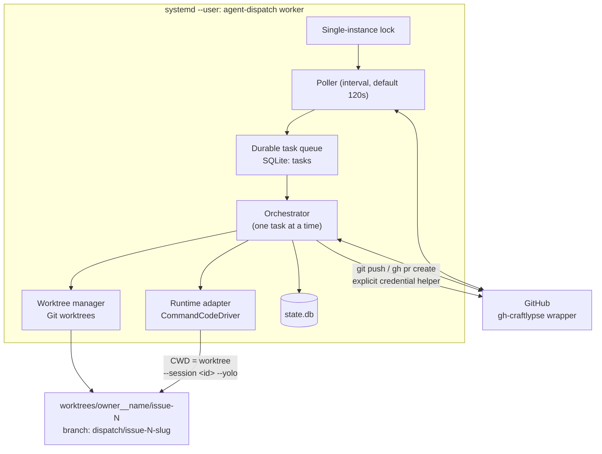

# agent-dispatch — Architecture and Task State Contract

**Issue:** #2 (design-only)
**Status:** Proposed for maintainer review
**Inputs:** [#1 / PR #7](https://github.com/MariuszBielecki288728/agent-dispatch/pull/7) — [`docs/feasibility.md`](./feasibility.md)
**Target environment:** `craftlypse-agent` (Ubuntu 24.04.5, user `craftlypse`, `systemd --user` with `Linger=yes`)
**Implementation plan:** Issues #3 → #6. This document does **not** implement the service.

---

## 1. Goal

A small personal-use tool that:

1. polls an allowlist of configured GitHub repositories for Issues labelled `take-it`,
2. runs a coding agent in a dedicated Git worktree owned by the orchestrator,
3. opens exactly one PR referencing the Issue, then waits,
4. resumes **the same agent session** to address PR feedback, but only after an explicit `agent:fix` handoff.

Explicitly optimised for **simplicity over production-grade multitenancy**. The VM is a trusted single-user development box where the maintainer already runs coding agents with broad permissions. This is not a sandboxing, secrets-broker, policy-engine, or permission-framework project.

---

## 2. Verified ground truth (observed on this VM)

Everything in this section was executed on `craftlypse-agent` on 2026-09-24 against Command Code CLI **v1.64.0**. Items that were *not* verified are marked as unknown rather than assumed.

### 2.1 Permission-mode behaviour (resolves the Issue #2 decision gate)

Issue #1 left an open decision: production unattended file mutation was **not demonstrated** under bounded permissions. The following bounded probes (run in throwaway `/tmp` scratch Git repos) resolve it.

| Probe | Flags used | Result | Mutation |
|---|---|---|---|
| A | `--yolo` | `subtype=success`, exit 0 | **ALLOWED** |
| B | `--permission-mode yolo` | `subtype=success`, exit 0 | **BLOCKED** |
| C | `--tools-all` | `subtype=success`, exit 0 | **BLOCKED** |
| D | `--session <id>` **without** `--yolo` | `subtype=success`, exit 0 | **BLOCKED** |

**Decisions derived from this:**

- **D1 — `--yolo` is the only verified working mutation unlock.** The documented flag name in `--help` (`--permission-mode yolo`) and the closest "enable everything" flag (`--tools-all`) do **not** unlock mutation in print mode. The architecture therefore specifies `--yolo` (alias of `--dangerously-skip-permissions`) as the configured permission mode, and the config records the *literal flag string* so it is auditable rather than implied.
- **D2 — `--yolo` must be re-passed on every invocation, including every resume.** Permission grants do not persist inside a resumed session (probe D). The runtime adapter therefore never treats permission state as sticky session metadata.
- **D3 — Model/effort are likewise re-passed explicitly on every resume.** `--model` persistence across resume was **not** verified. Re-passing the pinned values is a deliberate design choice: it makes "config change silently moves an existing session onto another model" structurally impossible, satisfying the pinning requirement in Issue #2.

### 2.2 Silent false-success hazard (highest-risk finding)

A run whose tool calls were **all blocked** still reported:

```json
{"type":"result","subtype":"success","stopReason":"end_turn","sessionId":"0e751342-…"}
```

with **exit code 0** and **no `isError` field anywhere in the stream**. A naive implementation that trusts `subtype == "success"` will mark a task complete while **nothing was written to disk**.

The only reliable in-band signal is a dedicated NDJSON event:

```json
{"type":"event","event":{"type":"tool_hook_blocked","toolName":"write_file",
 "hookOutput":"Error: Tool \"write_file\" requires permissions. Use --yolo (or --dangerously-skip-permissions) to enable file writes and shell commands in print mode."}}
```

In a successful `--yolo` run this event is **absent** (tool events progress `tool_queued → tool_running → tool_completed`); in each blocked run it was present (1–3 occurrences). This was confirmed by counting occurrences across runs.

> **Requirement:** the orchestrator MUST scan every run's event stream for `tool_hook_blocked` and treat any occurrence as a **hard task failure**, never as success. This is the single most important correctness rule in the design and is called out again in §8 and §9.

### 2.3 Session, stream, and flag facts

- `--output-format json` emits NDJSON: `run_start` carries `sessionId`; the final `result` line carries `subtype`, `sessionId`, `finalText`, `stopReason`, `usage{inputTokens,outputTokens,cacheReadTokens,cacheWriteTokens}`, `durationMs`.
- Resume via `--session <id>` keeps the **same** `sessionId` and retains prior-turn context (verified by asking the agent to recall a filename it created in an earlier turn).
- A turn-cap hit exits with **code 8** (per `--help`), distinct from a normal failure exit 1.
- Confirmed relevant flags: `-p/--print`, `--output-format`, `--session`, `-m/--model`, `--effort`, `--yolo` / `--dangerously-skip-permissions`, `--max-turns`, `-t/--trust`, `--skip-onboarding`, `--no-auto-update`, `--no-skills`, `--list-models`, `-w/--worktree`, `-r/--resume`. 80 models listed; default `deepseek/deepseek-v4-flash`.
- `commandcode status` / `whoami` expose authentication state without printing credentials.

### 2.4 Git credential hazard

On this VM `git config` contains **two** helpers for `github.com`: `/usr/bin/gh auth git-credential` **and** the approved `gh-craftlypse` helper. Which one wins depends on ordering. A worktree that merely inherits ambient config may therefore silently authenticate with an unapproved credential.

> **Requirement:** every Git remote operation in a managed worktree MUST pass an explicit, per-invocation helper:
> `git -c credential.https://github.com.helper="!<configured-wrapper> auth git-credential" …`

### 2.5 Labels

`take-it` and `agent:fix` **do not exist** in this repository yet (only GitHub's 10 default labels). Issue #3 must create them (or the maintainer must). Until then the trigger protocol is inert by construction — a safe default.

### 2.6 Explicitly unknown / not tested

- Whether `--model` persists across `--session` resume (design avoids depending on it).
- Whether `--tools-enable <names>` can produce a *narrower* working write grant than `--yolo` — **not probed**; assume it cannot.
- Behaviour of concurrent writers against a single session ID; the design prevents it structurally instead.
- Native VS Code Chat UI handoff of CLI sessions remains **unsupported by design** (Issue #1). Operators inspect/resume sessions in the integrated terminal inside the task worktree.
- Behaviour under VM sleep/reboot beyond `systemd --user` restart semantics.

---

## 3. Architecture overview

One Python package, one worker loop, one SQLite database, one `systemd --user` unit. No webhook server, no broker, no distributed leases, no dashboard.



### Component boundaries

| Component | Responsibility | Explicitly **not** responsible for |
|---|---|---|
| **Poller** | Read allowlisted repos for `take-it` Issues and `agent:fix` PRs; enqueue idempotently. | Starting agents; mutating labels it hasn't claimed. |
| **Queue / state store** | Durable task rows, phases, pinned runtime identity, feedback cursors. | Storing Issue/PR bodies (those stay on GitHub). |
| **Orchestrator** | Phase transitions, one-task-at-a-time scheduling, reconciliation, bounded retries. | Being a generic workflow/event-sourcing engine. |
| **Worktree manager** | Create/reuse exactly one branch+worktree per `(repo, issue)`; inject credential helper. | Serving as an OS security boundary. |
| **Runtime adapter** | `start` / `resume` / `status` / `stop` for one runtime; build argv; parse NDJSON; detect `tool_hook_blocked`. | Model selection policy, GitHub access, worktree layout. |
| **GitHub adapter** | Invoke the configured wrapper for issues/PRs/comments/labels and Git HTTPS auth. | Being a transport framework or auth-manager service. |
| **CLI** | `status`, `pause`, `resume`, `retry`, `open`. | Long-running business logic. |

### Runtime adapter contract

The smallest boundary that covers Issues #4–#6:

```python
start(task) -> RunResult      # new session; returns session_id + outcome
resume(task, instruction) -> RunResult
status(task) -> RuntimeStatus
stop(task) -> None

# RunResult: session_id, exit_code, subtype, stop_reason, usage,
#            tool_hook_blocked: bool, final_text, duration_ms
```

`CommandCodeDriver` is the only implementation in the MVP. Adding OpenCode or Codex later means adding one module — **not** rewriting queue, worktree, or review logic. This is deliberately *not* a universal provider-plugin system.

---

## 4. Managed worktree layout

Ownership is recorded, never inferred from directory names.

```
<worktree_root>/<owner>__<name>/issue-<N>/     # e.g. …/MariuszBielecki288728__agent-dispatch/issue-4/
.git/dispatch/                                 # orchestrator state dir (ignored by target repo)
```

- **Branch:** deterministic, safe slug, e.g. `dispatch/issue-<N>-<kebab-title-truncated>`; collision-suffixed only when the existing branch is provably ours and busy.
- **Base:** configured `base_branch`, fetched fresh before creation.
- The user's normal checkout is **never** modified.
- Worktrees are created with ordinary `git worktree add`; Command Code's own `-w` flag is **not** used, so the orchestrator owns lifecycle, naming, and credentials (per Issue #2 §4).
- Existing PR/branch for the same Issue is adopted rather than duplicated.
- A dirty, unknown, or foreign worktree is **not** reused and **not** deleted — the task moves to `needs manual attention`.
- Cleanup happens only via explicit CLI policy, never as a side effect of task completion.

---

## 5. Configuration

Sample: [`config/agent-dispatch.example.toml`](../config/agent-dispatch.example.toml) · Schema: [`config/config.schema.json`](../config/config.schema.json)

Config is **TOML** parsed with stdlib `tomllib` (Python 3.12.3 on this VM — zero third-party dependencies).

Keys that matter for the Issue #2 acceptance list:

| Requirement | Key |
|---|---|
| Configurable GitHub wrapper command | `github.command` |
| Credential helper for Git HTTPS | `github.credential_helper` |
| Repo name + path | `repos."<owner>/<name>".path` |
| Trigger / review labels | `github.labels.trigger`, `github.labels.review_handoff` |
| Command Code runtime / model / effort | `repos.….runtime.{driver,model,effort}` |
| **Explicit** permission mode | `repos.….runtime.permission_mode` (+ `permission_flag`) |
| Timeout | `worker.run_timeout_seconds` |
| Polling interval | `worker.poll_interval_seconds` |

Two rules the config layer enforces at startup (**fail fast, never silently substitute**):

1. **Allowlist.** Any repo not present in `repos` is refused with a clear error, before any API call.
2. **No silent model/provider substitution.** An unsupported `driver`/`model`/`effort` combination is a startup error. The worker never falls back to another paid model.

No tokens, credentials, or provider auth material appear in config or examples — the wrapper owns credentials and exposes them only to its child process.

---

## 6. Task state contract

### Phases

```
queued → running → awaiting_review → feedback_queued → running → …
                 ↘ paused / failed / needs_attention / finished
```

- `queued` — discovered, not yet started.
- `running` — an agent process is live for this task (at most one globally in the MVP).
- `awaiting_review` — PR open, no handoff pending.
- `feedback_queued` — `agent:fix` claimed; one consolidated round pending.
- `paused` — maintainer-initiated; no new rounds.
- `failed` — bounded retries exhausted, or a blocking error.
- `needs_attention` — ambiguous state requiring a human (e.g. foreign worktree, PR closed externally).
- `finished` — PR merged or Issue closed.

### SQLite sketch

```sql
CREATE TABLE tasks (
  id                INTEGER PRIMARY KEY,
  repo              TEXT    NOT NULL,          -- "owner/name"
  issue_number      INTEGER NOT NULL,
  title             TEXT,
  phase             TEXT    NOT NULL DEFAULT 'queued',
  branch            TEXT,
  worktree_path     TEXT,
  base_branch       TEXT,
  pr_number         INTEGER,
  -- pinned runtime identity (never changed after start)
  runtime_driver    TEXT    NOT NULL,
  runtime_model     TEXT    NOT NULL,
  runtime_effort    TEXT,
  permission_mode   TEXT    NOT NULL,
  session_id        TEXT,
  -- review loop
  review_round      INTEGER NOT NULL DEFAULT 0,
  feedback_cursor   TEXT,                       -- last acknowledged event id/ts
  -- bookkeeping
  attempts          INTEGER NOT NULL DEFAULT 0,
  last_error        TEXT,
  last_run_at       TEXT,
  created_at        TEXT    NOT NULL,
  updated_at        TEXT    NOT NULL,
  UNIQUE (repo, issue_number)                   -- one task per Issue, always
);

-- Idempotency for feedback ingestion (Issue #5).
CREATE TABLE feedback_events (
  id            INTEGER PRIMARY KEY,
  task_id       INTEGER NOT NULL REFERENCES tasks(id),
  gh_event_id   TEXT    NOT NULL,               -- stable GitHub id
  kind          TEXT    NOT NULL,               -- comment | review | inline
  consumed_round INTEGER,
  UNIQUE (task_id, gh_event_id)                 -- restarts cannot double-process
);
```

`UNIQUE (repo, issue_number)` is what makes duplicate branch, session, PR, or review-round creation impossible across restarts. `feedback_events` gives the review loop its transactional "at most one round" guarantee.

State and IDs live in SQLite **outside** target repositories; Issue/PR text stays on GitHub.

---

## 7. Trigger and review-handoff protocol

### `take-it` (dispatch intent)

- An Issue labelled `take-it` expresses *dispatch intent*. It stays on the Issue for the whole active lifetime and is **not** a mirror of local status.
- Already-labelled Issues are found again after a restart (reconciliation, not event replay).
- **Removal** = maintainer intent to stop. The worker stops starting new rounds; an in-flight run is left to finish or is stopped by explicit CLI `pause`.
- **Re-add after removal** starts a fresh scheduling pass but reuses the existing task row, branch, worktree, and — if present — session ID. It never creates a duplicate PR.
- **Merged** → task `finished`, PR left untouched.
- **Closed without merge** → task `finished` (no automatic reopen). Surfaced in `status` with the Issue URL.

### `agent:fix` (explicit review handoff)

- **PR review comments alone never start an agent.** Mere feedback arrival only marks the task as having pending review input.
- A maintainer adds `agent:fix` to the PR. Exactly one **consolidated** follow-up round then runs, resuming the task's **existing** session on the **existing** worktree/branch.
- The label is claimed (and only removed) **after** the round is durably queued, so a crash cannot lose the handoff.
- Feedback is snapshotted as "everything new since `feedback_cursor`" across top-level comments, inline review comments, and submitted reviews.
- One round at most is queued. If feedback arrives mid-run, the next round is deferred, never run concurrently in the same worktree.
- Re-arming for a later round = remove `agent:fix`, let the round complete, add it again.

### Shared-identity safety (critical)

The reviewer and implementer may be **the same GitHub username**. Therefore:

- Role is **never** inferred from login.
- The agent's own PR summary, replies, and progress comments must **never** re-trigger a run. Provenance is tracked by recorded event identity (`feedback_events.gh_event_id`) and round boundaries, not by author name or model.
- An untrusted GitHub comment is *task input*, and a same-account label is **not** an authorization boundary. This is documented plainly rather than dressed up as security; if strong provenance is ever needed, a separate reviewer identity or local maintainer confirmation is the answer.

### What the agent is asked to do with feedback

Not "implement every comment": verify current code, push back on disagreements, and surface requests that exceed Issue scope or need maintainer acceptance. Then push to the same PR branch, report validation truthfully, and return to `awaiting_review`. The agent can never approve or merge its own work.

---

## 8. Worker loop, concurrency, and the runtime command line

### Loop

```
acquire single-instance lock (else exit)      # prevents two workers
reconcile local state with GitHub             # crash recovery, §9
discover: take-it Issues + agent:fix PRs
enqueue / flip phases (idempotent)
while budget and no run in flight:
    pick oldest eligible task (max 1 active total)
    ensure worktree + branch + credential helper
    build instruction (Issue URL, repo AGENTS.md, scope, non-goals)
    run runtime with timeout
    validate stream  ← see below
    push branch, open/reuse PR, record PR identity
    phase = awaiting_review
sleep(poll_interval_seconds)
```

### Verified Command Code invocation

First turn:

```bash
cd <worktree>
commandcode -p "<bounded instruction>" \
  --model deepseek/deepseek-v4-flash --effort medium \
  --yolo \
  --output-format json --max-turns 40 \
  --skip-onboarding --no-auto-update \
  > run.ndjson
```

Follow-up round (identical except `--session`):

```bash
cd <worktree>
commandcode -p "<consolidated review feedback>" \
  --session <pinned-session-id> \
  --model deepseek/deepseek-v4-flash --effort medium \
  --yolo \
  --output-format json --max-turns 40 \
  --skip-onboarding --no-auto-update \
  > run.ndjson
```

`--yolo` and the pinned `--model`/`--effort` appear on **every** invocation (D2/D3). The instruction is passed as a bounded string containing the Issue URL, repository instructions, and explicit scope/non-goals — not the raw Issue body verbatim.

### Mandatory post-run validation

A run is accepted **only if all** hold:

1. exit code `0` (a cap hit exits `8`, which is a bounded failure)
2. a `result` line exists with `subtype == "success"`
3. a non-empty `session_id` was captured from `run_start` / `result`
4. on resume, the returned `session_id` **equals** the pinned one
5. **zero `tool_hook_blocked` events** ← the false-success guard (§2.2)
6. the worktree is actually dirty/changed as expected (cheap secondary sanity check)

Failing any check surfaces a real error. Rule 5 exists because the CLI would otherwise report success for a run that wrote nothing.

### Concurrency and limits

- **One active task total** for the MVP (`worker.max_concurrent_tasks = 1`).
- At most **one writer per worktree**, guaranteed by the single-task rule.
- `run_timeout_seconds` (default 3600) kills a hung run.
- `max_attempts` (default 3) with backoff bounds retries; exhaustion → `failed` with a human recovery path.
- A single-process lock file prevents accidentally running two workers.

---

## 9. Failure handling and reconciliation

Bounded, boring recovery — no self-healing machinery.

| Crash point | Reconciliation on startup / next poll |
|---|---|
| Agent process dies mid-run | `running` with a dead PID → `failed`, bounded retry re-uses session ID |
| Branch pushed, PR creation failed | Detect existing remote branch; retry PR creation only, never re-run the agent |
| PR created but DB write failed | Discover PR by head branch **and** verify it references the Issue; adopt its real PR identity |
| Duplicate poll / label event | `UNIQUE (repo, issue_number)`; `status` already terminal → no-op |
| Handoff queued but crash before ack | Round re-derived from unclaimed `agent:fix` + `feedback_cursor`; never double-applied |
| PR closed or merged externally | Stop new rounds; move to `finished` |
| Issue relabelled `take-it` removed | Stop new rounds; keep existing work |
| Worktree dirty / unknown / foreign | `needs_attention` — **never** auto-delete |
| Model/provider unavailable, auth denied | `failed` with the real error. **No** silent model substitution |
| Repo not in credential allowlist | Fail fast at startup / before the first API call with an explicit message |
| GitHub rate limit | Backoff; task stays queued |
| VM asleep or off | Nothing runs; on boot `systemd --user` restarts and reconciles |

Ambiguous cases prefer an explicit **`needs_attention`** state over clever automation. `status` always shows the Issue/PR URLs, branch, worktree, session ID, last observed validation outcome, and any outstanding maintainer decision.

---

## 10. Security posture and tradeoffs

### Stated plainly

- **`--yolo` grants the agent unrestricted shell and file access as `craftlypse`.** The maintainer has explicitly accepted this on this trusted personal VM. Documented as a *trust choice*, not isolation.
- **A Git worktree is Git isolation only.** It is **not** a filesystem, process, network, or credential boundary. In allow-all mode the agent can read and write outside its worktree and can reach the same user's credentials. These are consciously accepted risks, not guarantees the orchestrator can enforce. This document does **not** claim `--yolo + worktree` forms a sandbox.
- **GitHub access is wrapper-scoped, not agent-scoped.** The `gh-craftlypse` credential is limited to selected repositories; the wrapper validates ownership/mode (`0600`) and injects `GH_TOKEN` only into its child. The agent, having unrestricted shell access, could in principle attempt to bypass it — so this is described as a *checkable operational guardrail*, not a hard boundary.
- The wrapper name is **configurable**, not hardcoded into the reusable package; this VM binds it to `gh-craftlypse`. Tokens are never inspected, printed, copied, or committed. `gh auth login` is never run and raw `gh` is never substituted on this VM.
- The double credential-helper hazard (§2.4) is neutralised by an explicit per-invocation helper in managed worktrees.

### Operational guardrails

Repository allowlist · no automatic merge · no Issue closure · no reviewer approval · no touching unrelated repositories · one task at a time · run timeout and bounded retries · no token or raw-log dumping · explicit `pause`/`stop`.

### Consciously accepted tradeoffs

| Tradeoff | Rationale |
|---|---|
| Broad `--yolo` permissions | Simplicity on a single-user trusted VM; the alternative was a policy engine this project deliberately avoids. |
| Polling (~120 s) instead of webhooks | No inbound endpoint on a personal VM, no broker, no public exposure. |
| Single active task | Prevents two writers in one worktree and keeps model cost predictable. |
| Shared GitHub identity for review handoff | Simple; provenance tracked by event identity, with the limitation documented rather than hidden. |
| Worktree ≠ sandbox | Honest limitation instead of security theatre. |
| SQLite + one process | Sufficient durability and auditability for one VM. |

---

## 11. MVP / later / out of scope

### MVP (Issues #3–#6)

- One package, one worker loop, one SQLite DB, one `systemd --user` unit.
- GitHub adapter over the **configurable** wrapper, with credential-helper injection.
- `CommandCodeDriver` only, with the verified argv and the `tool_hook_blocked` guard.
- Orchestrator-owned worktrees, one per `(repo, issue)`, deterministic branch naming.
- `take-it` dispatch + explicit `agent:fix` single-round review loop with same-session resume.
- CLI: `status`, `pause`, `resume`, `retry`, `open`, `doctor`, `dry-run`.
- Bounded retries, restarts, and startup reconciliation.
- Startup capability validation and repo allowlist enforcement.

### Later (explicitly not MVP)

- Additional runtime drivers (OpenCode, Codex) as small adapters.
- Multi-repo concurrency above one.
- Optional OS/container isolation as a deployment choice.
- An orchestrator-owned reviewer job emitting a *trusted* completed-review event instead of a manual PR label.

### Out of scope

- Webhook server, message broker, distributed leases, cloud service, dashboard, GUI.
- Auto-merge, automatic reviewer fleets, Issue closure, forced pushes to unrelated branches.
- Sandbox tiers, permission policy languages, secret-vault integration, multi-tenant auth.
- Universal model-provider plugin framework.
- GitHub Actions execution of unattended paid agents.
- Docker/container requirement as an MVP acceptance gate.

### Portability statement

**Command Code is the initial implementation, not a permanent provider lock-in.** Switching runtime later is *configuration plus one small adapter*; selecting a different supported model *within* Command Code is usually just a config change. Existing tasks remain pinned to their recorded `runtime_driver`, `runtime_model`, and `session_id`, and config changes never mutate an in-flight or resumable session.

---

## 12. Verification outline for Issues #3–#6

Routine CI must not spend model credits; real runs are opt-in and low-cost.

**#3 — foundation (no agent)**
- Mock GitHub adapter: idempotent discovery of `take-it`; enqueue twice yields one task.
- Denied/absent repo → explicit early failure; mock coverage for allowlist denial.
- Restart mid-queue → no duplicate task rows.
- Real `systemd --user` run against the actual wrapper (opt-in).
- Single-instance lock proven to reject a second worker.

**#4 — execution and PR**
- Disposable-repo E2E: labelled Issue → exactly one branch/worktree → one persisted session → bounded run → PR referencing the Issue → `awaiting_review`.
- Repeat processing and worker restart do not duplicate branch, session, or PR.
- Same-session follow-up proven by an **observable session identifier and retained context**, not a summary prompt.
- Failure surfacing with no silent success: unavailable model, auth denial, timeout, interrupted worker, dirty worktree, failed tests, failed push, failed PR API.
- **`tool_hook_blocked` must fail the task** — regression test with a mocked blocked stream and the real success-shaped `subtype` (§2.2). This is a required test case.
- No secrets committed or leaked to logs.

**#5 — review loop**
- Fixture with **reviewer and implementer sharing one GitHub login**, mixing top-level comment, inline thread, review submission, review reply, edited comment, and agent progress.
- Exactly one handoff invokes the original session with only the intended new feedback.
- Repeated polling, concurrent comments, restart after handoff before ack, and handoff during a run: no lost feedback, no duplicate rounds, no loops.
- Vague comment, agent's own reply, stale or closed PR, unknown PR → never triggers implementation.
- No auto-merge, no cross-repo mutation.

**#6 — operational release**
- Fault/reconciliation matrix exercised: duplicate events, pagination gaps, crash during run, push-ok/timeout, PR created/DB write failed, PR merged or closed externally, provider unavailable, VM downtime, rate limit, edited/deleted comments, branch-base divergence.
- Multi-repo config: no credential, state, or worktree collisions; concurrency bounded; credentials absent from Git/logs/artifacts.
- Install/uninstall/upgrade documented; `doctor`, `status`, `pause`, `resume`, `retry`, `dry-run` verified; no VS Code window required.
- Pilot report split into **Observed on VM**, **Automated/tested**, and **Not tested / maintainer-only**, including one real same-session review cycle.

---

## 13. Open items for maintainer confirmation

1. **Gate the MVP on `--yolo`.** This design uses `--yolo` because it is the only verified mutation unlock (§2.1). Confirm that is acceptable, or request a bounded alternative — but note `--permission-mode yolo` and `--tools-all` are *not* working substitutes.
2. **Label creation.** `take-it` and `agent:fix` do not exist yet; confirm who creates them.
3. **Disposable test repository.** Confirm which repo is allowlisted for the #4/#6 end-to-end runs, and confirm `agent-dispatch` itself is within the credential's permitted set.
4. **Effort default.** `--effort medium` is proposed; adjust if the default model behaves better at another level.
